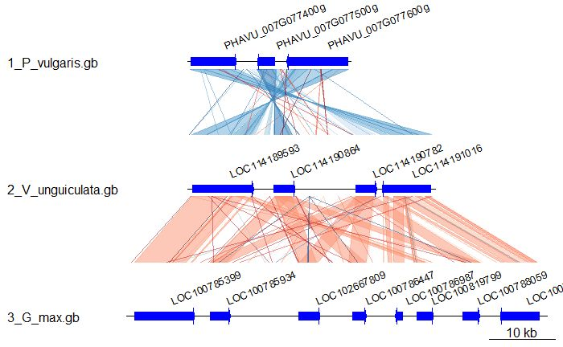

Figure Examples
================

#### Adam Steinbrenner 
<astein10@uw.edu> 
<http://steinbrennerlab.org> 
Updated 5/13/2019

## [alluvial.md](https://github.com/steinbrennerlab/figure_examples/blob/master/alluvial.md)
#### Visualize flows of gene lists across categories in different conditions.   
Input: DESeq output statistics, Output: Alluvial diagram using ggalluvial and ggplot.  
See alluvial.md for rendered markdown, alluvial.Rmd for scripts

## [ggtree.md](https://github.com/steinbrennerlab/figure_examples/blob/master/ggtree.md)
#### Visualize gene features (species, HMM, heatmap etc) on a phylogenetic tree using ggtree  
Input: newick tree, associated text files specifying features of interest and heatmap-type numerical data  
Output: ggTree diagram with color, shape etc reflecting features

## [genoplot.md](https://github.com/steinbrennerlab/figure_examples/blob/master/genoplot.md)
#### Draw syntenic DNA segments based on genbank file inputs and blast comparisons   
Input: a folder containing .gb sequences and .txt blast comparisons  
Output: Features of interest drawn on dna segments, with syntenic comparisons

