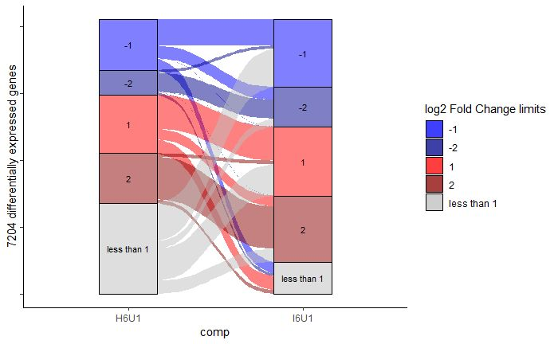
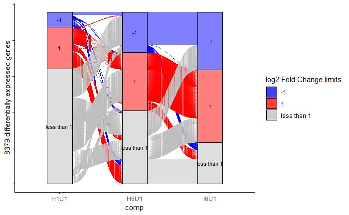

Alluvial Diagrams
================

#### Adam Steinbrenner

#### <astein10@uw.edu>

#### <http://steinbrennerlab.org>

#### Updated 5/10/2019

#### Visualizing flows of gene lists across categories in different conditions.  Input: DESeq output statistics, Output: Alluvial diagram using ggalluvial and ggplot.

#### See alluvial.md for rendered markdown, alluvial.Rmd for scripts

test