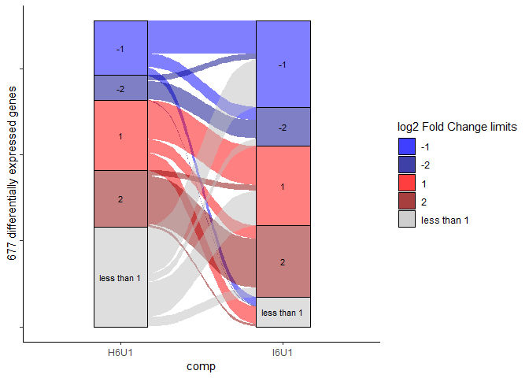
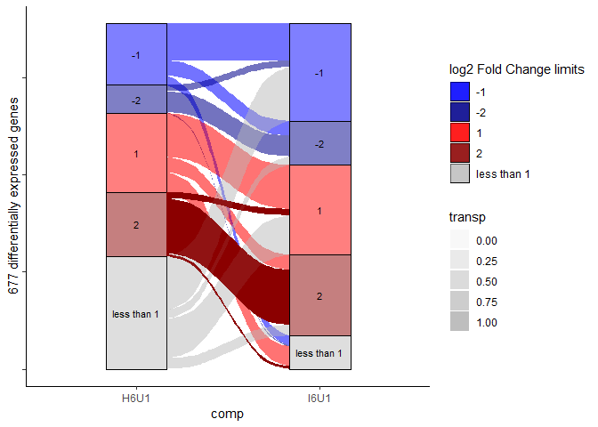
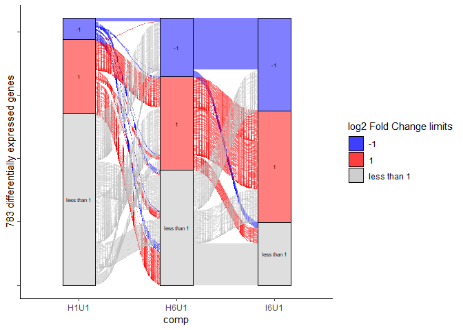

Alluvial Diagrams
================

-   [About the scripts](#about-the-scripts)
-   [Install packages if needed](#install-packages-if-needed)
-   [Generate DESeq output](#generate-deseq-output)
-   [Load libraries and load sample file](#load-libraries-and-load-sample-file)
-   [Visualize genes across two conditions](#visualize-genes-across-two-conditions)
-   [Highlight a specific flow](#highlight-a-specific-flow)
-   [Visualize genes across three conditions](#visualize-genes-across-three-conditions)
-   [Print to pdf after generating the ggplot](#print-to-pdf-after-generating-the-ggplot)
-   [Further dpylr steps for post-filter analysis and gene list export](#further-dpylr-steps-for-post-filter-analysis-and-gene-list-export)

About the scripts
-----------------

Adam Steinbrenner
<astein10@uw.edu>
<http://steinbrennerlab.org>
Updated 5/10/2019

The following R scripts use ggalluvial to visualize changes in sets of genes over different conditions (timepoints, treatments etc)

------------------------------------------------------------------------

Install packages if needed
--------------------------

    install.packages("ggalluvial")
    install.packages("ggplot2")
    install.packages("alluvial")
    install.packages("readr")
    install.packages("dpylr")

------------------------------------------------------------------------

Generate DESeq output
---------------------

The scripts take in DESeq output comparisons (merged with bind\_rows) with an additional column specifying which comparison the stats came from. A simple pipeline to do this is below with conditions "H1, H6..." See DESeq documentation for details

    countdata <- read.table("combined_counts_input.csv", header=TRUE,sep=",",row.names = 1)

    countdata <- as.matrix(countdata)
    head(countdata)
    colnames(countdata)


    (condition <- factor(c(
     rep("H1",4),
     rep("H6",4),
     rep("I1",4),
     rep("I6",4),
     rep("U1",4)
     )
     )
     )

    (coldata <- data.frame(row.names=colnames(countdata), condition))
    dds <- DESeqDataSetFromMatrix(countData=countdata, colData=coldata, design=~condition)
    dds <- DESeq(dds)

    resI1H1 <- data.frame(results(dds, contrast=c("condition","I1","H1")))
    resI6H6 <- data.frame(results(dds, contrast=c("condition","I6","H6")))
    resI6I1 <- data.frame(results(dds, contrast=c("condition","I6","I1")))

    resI1H1$gene<-rownames(resI1H1)
    resI6H6$gene<-rownames(resI6H6)
    resI6I1$gene<-rownames(resI6I1)

    resI1H1$comp<-"I1H1"
    resI6H6$comp<-"I6H6"
    resI6I1$comp<-"I6I1"

    resI1H1 <- mutate(resI1H1,id=row_number())
    resI6H6 <- mutate(resI6H6,id=row_number())
    resI6I1 <- mutate(resI6I1,id=row_number())

    dfs <- list(resI1H1,resI6H6,resI6I1,resH6H1,resH1U1,resI1U1,resH6U1,resI6U1)
    all <- bind_rows(dfs,.id=NULL)
    rownames(all) <- all$gene
    write.csv(all,file="DESeq_allcomps_alluv.csv")

------------------------------------------------------------------------

Load libraries and load sample file
-----------------------------------

``` r
deseq_input <- read_csv("DEseq_alluvial_example.csv")
```

    ## Warning: Missing column names filled in: 'X1' [1]

    ## Parsed with column specification:
    ## cols(
    ##   X1 = col_double(),
    ##   baseMean = col_double(),
    ##   log2FoldChange = col_double(),
    ##   lfcSE = col_double(),
    ##   stat = col_double(),
    ##   pvalue = col_double(),
    ##   padj = col_double(),
    ##   comp = col_character(),
    ##   gene = col_character(),
    ##   id = col_double()
    ## )

``` r
#Load and make sure it looks OK
deseq_input
```

    ## # A tibble: 20,424 x 10
    ##       X1 baseMean log2FoldChange  lfcSE    stat   pvalue    padj comp 
    ##    <dbl>    <dbl>          <dbl>  <dbl>   <dbl>    <dbl>   <dbl> <chr>
    ##  1     1     5.11        -0.404   0.835  -0.484  0.628    0.853  I1H1 
    ##  2     2   223.           0.654   0.233   2.81   0.00501  0.0716 I1H1 
    ##  3     3     9.57         0.470   0.877   0.537  0.592    0.835  I1H1 
    ##  4     4    13.4         -0.0573  0.446  -0.129  0.898    0.967  I1H1 
    ##  5     5    26.0          0.184   0.312   0.589  0.556    0.817  I1H1 
    ##  6     6     0           NA      NA      NA     NA       NA      I1H1 
    ##  7     7   132.           0.150   0.245   0.611  0.541    0.808  I1H1 
    ##  8     8     8.09        -0.723   0.822  -0.880  0.379    0.700  I1H1 
    ##  9     9     1.93        -1.23    1.12   -1.11   0.268   NA      I1H1 
    ## 10    10     3.24        -1.68    1.05   -1.60   0.109   NA      I1H1 
    ## # ... with 20,414 more rows, and 2 more variables: gene <chr>, id <dbl>

------------------------------------------------------------------------

Visualize genes across two conditions
-------------------------------------

Example: 1 hour changes in damage+water vs undamaged ("H1U1") and damage+peptide vs undamaged ("I1U1")

``` r
#specify comparisons to load.
comp1 <- "H6U1"
comp2 <- "I6U1"

#Specify number of comparisons "numcomp"
numcomp <- 2

#Specify other parameters
pval <- 0.05
higher <- 2
high <- 1
lower <- -2
low <- -1
otherwise <- "less than 1"
set <- deseq_input %>% 
  mutate(sig = ifelse(padj < pval,1,0)) %>%
  filter(comp==comp1 | comp==comp2) %>%
  #creates variable "class" based on threshold criteria, e.g. foldChange > or < variables higher/lower
  mutate(class = ifelse(is.na(sig),otherwise,
                    ifelse(sig==1,
                      ifelse(log2FoldChange>higher,higher,
                      ifelse(log2FoldChange>high,high,
                      ifelse(log2FoldChange<lower,lower,
                      ifelse(log2FoldChange<low,low,otherwise)))),otherwise))) %>% 
  #this group and filter step is key: It filters the large set of genes not differentially expressed in both conditions.  It does so by keeping only genes that are not of class "otherwise" OR area any value that isn't repeated 2 times.
  group_by(gene,class) %>% 
  filter(class!=otherwise | n()<numcomp) %>%
  #adds a column specifying transparency variable
  mutate(transp = ifelse(class==higher,1,0.00))

require(scales)
figure <- ggplot(set,
  aes(x=comp, stratum = class, alluvium = id, y = id,label=class,fill=class)) + 
  geom_flow() + 
  geom_stratum(alpha = .5) +
  geom_text(stat = "stratum", size = 3) +
  theme(legend.position = "none") +
  theme_classic() +
  scale_y_continuous(labels=NULL) + 
  scale_fill_manual(
  #5 colors for the 5 classes; change if you want a different number
  values = c("blue1", "blue4", "red1", "red4", "grey")) +
  guides(fill=guide_legend(title="log2 Fold Change limits")) +
  #Corrects the order of x categories
  scale_x_discrete(limits = c(comp1,comp2)) +
  #counts and prints as the ylabel the number of remaining datapoints within a single comparison axis
  ylab(paste(nrow(filter(set,comp==comp1)),"differentially expressed genes"))

#Visualize the alluvial diagram
figure
```



------------------------------------------------------------------------

Highlight a specific flow
-------------------------

Use alpha in the geom\_flow, referencing the earlier mutated variable "transp"

``` r
figure2 <- figure + 
  geom_flow(aes(fill = class, alpha = transp))

figure2
```



------------------------------------------------------------------------

Visualize genes across three conditions
---------------------------------------

Three conditions is more complicated to visualize. By default the two spacer sections between axes have no relation to one another (so a given gene's position does not actually "flow" from condition 1-&gt;2-&gt;3). Instead we have to specify ggflow(stat="alluvium"). This takes longer to render and looks more complicated, but correctly shows gene flows across the entire horizontal diagram.

Because more flows complicates the diagrams, it's best to only have 3 classes (categories), e.g. only one tier "upregulated" versus multiple thresholds.

Example below: Flow 1 shows gene behavior over a timecourse (damage vs. undamaged at 1hr and 6hr), and flow 2 shows how the same genes behave after peptide treatment

See <https://corybrunson.github.io/ggalluvial/reference/stat_alluvium.html> for details

``` r
#See example with 2 comparisons above for more thorough comments
#specify comparisons to load.  Current code allows 3
comp1 <- "H1U1"
comp2 <- "H6U1"
comp3 <- "I6U1"

numcomp <- 3

pval <- 0.05
higher <- 1
high <- 1
lower <- -1
low <- -1
otherwise <- "less than 1"
set <- deseq_input %>% 
  mutate(sig = ifelse(padj < pval,1,0)) %>%
  #Changed to include any row from the 3 specified comparisons
  filter(comp==comp1 | comp==comp2 | comp==comp3) %>%
  mutate(class = ifelse(is.na(sig),otherwise,
                    ifelse(sig==1,
                      ifelse(log2FoldChange>higher,higher,
                      ifelse(log2FoldChange>high,high,
                      ifelse(log2FoldChange<lower,lower,
                      ifelse(log2FoldChange<low,low,otherwise)))),otherwise))) %>% 
  group_by(gene,class) %>% 
  #Filter now filters out genes with 3 instances, not 2
  filter(class!=otherwise | n()<numcomp)

require(scales)
figure <- ggplot(set,
  aes(x=comp, stratum = class, alluvium = id, y = id,label=class,fill=class)) + 
  ###To do: visualize a flow of interest using aes(alpha=high if we're interested).  (Use a mutate to generate a new var)
  geom_flow(stat="alluvium",lode.guidance = "leftward") +
  geom_stratum(alpha = .5) +
  geom_text(stat = "stratum", size = 2) +
  theme(legend.position = "none") +
  theme_classic() +
  scale_y_continuous(labels=NULL) + 
  scale_fill_manual(
  values = c("blue1", "red1", "grey")) +
  guides(fill=guide_legend(title="log2 Fold Change limits")) +
  scale_x_discrete(limits = c(comp1,comp2,comp3)) +
  ylab(paste(nrow(filter(set,comp==comp1)),"differentially expressed genes"))
figure
```



------------------------------------------------------------------------

Print to pdf after generating the ggplot
----------------------------------------

    pdf("output.pdf")
    figure
    dev.off()

------------------------------------------------------------------------

Further dpylr steps for post-filter analysis and gene list export
-----------------------------------------------------------------

dpylr is great for further filtering of the resulting classified gene lists.For example, the following example produces a list of 235 genes that go from upregulated (in comparison 1) to no differential expression (less than 1, comp 2) to upregulated (comp 3)

``` r
list <- filter(set,
        #filters the gene set from an analysis above to keep only genes that meet one of three conditions
        (comp==comp1 & class==1) | (comp==comp2 & class==otherwise) | (comp==comp3 & class==1)) %>% 
        group_by(gene) %>% 
        #Only keep genes that occur 3 times (i.e. meet all three conditions) and specify the data you want to keep
        filter(n()==3 & comp==comp1)
#sort by fold change
arrange(list,desc(log2FoldChange))
```

    ## # A tibble: 19 x 12
    ## # Groups:   gene [19]
    ##        X1 baseMean log2FoldChange lfcSE  stat   pvalue     padj comp  gene 
    ##     <dbl>    <dbl>          <dbl> <dbl> <dbl>    <dbl>    <dbl> <chr> <chr>
    ##  1 121432    93.5            6.93 0.737  9.39 5.81e-21 3.28e-19 H1U1  Vigu~
    ##  2 121377     8.19           5.45 1.20   4.56 5.09e- 6 7.11e- 5 H1U1  Vigu~
    ##  3 121433    56.5            5.28 0.544  9.72 2.52e-22 1.51e-20 H1U1  Vigu~
    ##  4 119371    34.3            4.92 0.553  8.90 5.80e-19 2.92e-17 H1U1  Vigu~
    ##  5 120860    28.5            4.28 0.535  8.00 1.25e-15 5.03e-14 H1U1  Vigu~
    ##  6 121348   170.             3.90 0.330 11.8  3.36e-32 3.31e-30 H1U1  Vigu~
    ##  7 119515    77.8            3.15 0.478  6.58 4.63e-11 1.26e- 9 H1U1  Vigu~
    ##  8 121121     7.33           2.65 0.856  3.10 1.96e- 3 1.31e- 2 H1U1  Vigu~
    ##  9 119167     7.66           2.48 0.729  3.40 6.62e- 4 5.27e- 3 H1U1  Vigu~
    ## 10 120931     4.03           2.47 0.928  2.66 7.90e- 3 4.06e- 2 H1U1  Vigu~
    ## 11 119885   214.             2.42 0.234 10.3  4.55e-25 3.14e-23 H1U1  Vigu~
    ## 12 119795    10.3            2.37 0.681  3.48 5.09e- 4 4.20e- 3 H1U1  Vigu~
    ## 13 121011    18.7            2.27 0.565  4.01 5.96e- 5 6.47e- 4 H1U1  Vigu~
    ## 14 121482     8.95           2.12 0.712  2.97 2.96e- 3 1.84e- 2 H1U1  Vigu~
    ## 15 120375   341.             2.07 0.187 11.1  1.35e-28 1.11e-26 H1U1  Vigu~
    ## 16 121199    22.9            1.74 0.459  3.78 1.54e- 4 1.49e- 3 H1U1  Vigu~
    ## 17 120792    43.4            1.35 0.271  4.97 6.69e- 7 1.10e- 5 H1U1  Vigu~
    ## 18 120024    27.4            1.13 0.375  3.02 2.52e- 3 1.61e- 2 H1U1  Vigu~
    ## 19 119654   983.             1.04 0.210  4.96 7.10e- 7 1.16e- 5 H1U1  Vigu~
    ## # ... with 3 more variables: id <dbl>, sig <dbl>, class <chr>

``` r
list
```

    ## # A tibble: 19 x 12
    ## # Groups:   gene [19]
    ##        X1 baseMean log2FoldChange lfcSE  stat   pvalue     padj comp  gene 
    ##     <dbl>    <dbl>          <dbl> <dbl> <dbl>    <dbl>    <dbl> <chr> <chr>
    ##  1 119167     7.66           2.48 0.729  3.40 6.62e- 4 5.27e- 3 H1U1  Vigu~
    ##  2 119371    34.3            4.92 0.553  8.90 5.80e-19 2.92e-17 H1U1  Vigu~
    ##  3 119515    77.8            3.15 0.478  6.58 4.63e-11 1.26e- 9 H1U1  Vigu~
    ##  4 119654   983.             1.04 0.210  4.96 7.10e- 7 1.16e- 5 H1U1  Vigu~
    ##  5 119795    10.3            2.37 0.681  3.48 5.09e- 4 4.20e- 3 H1U1  Vigu~
    ##  6 119885   214.             2.42 0.234 10.3  4.55e-25 3.14e-23 H1U1  Vigu~
    ##  7 120024    27.4            1.13 0.375  3.02 2.52e- 3 1.61e- 2 H1U1  Vigu~
    ##  8 120375   341.             2.07 0.187 11.1  1.35e-28 1.11e-26 H1U1  Vigu~
    ##  9 120792    43.4            1.35 0.271  4.97 6.69e- 7 1.10e- 5 H1U1  Vigu~
    ## 10 120860    28.5            4.28 0.535  8.00 1.25e-15 5.03e-14 H1U1  Vigu~
    ## 11 120931     4.03           2.47 0.928  2.66 7.90e- 3 4.06e- 2 H1U1  Vigu~
    ## 12 121011    18.7            2.27 0.565  4.01 5.96e- 5 6.47e- 4 H1U1  Vigu~
    ## 13 121121     7.33           2.65 0.856  3.10 1.96e- 3 1.31e- 2 H1U1  Vigu~
    ## 14 121199    22.9            1.74 0.459  3.78 1.54e- 4 1.49e- 3 H1U1  Vigu~
    ## 15 121348   170.             3.90 0.330 11.8  3.36e-32 3.31e-30 H1U1  Vigu~
    ## 16 121377     8.19           5.45 1.20   4.56 5.09e- 6 7.11e- 5 H1U1  Vigu~
    ## 17 121432    93.5            6.93 0.737  9.39 5.81e-21 3.28e-19 H1U1  Vigu~
    ## 18 121433    56.5            5.28 0.544  9.72 2.52e-22 1.51e-20 H1U1  Vigu~
    ## 19 121482     8.95           2.12 0.712  2.97 2.96e- 3 1.84e- 2 H1U1  Vigu~
    ## # ... with 3 more variables: id <dbl>, sig <dbl>, class <chr>

``` r
#write_csv(list,"1_0_1.csv")
```

------------------------------------------------------------------------

Old code is included in the R markdown file below but hidden in the html rendering. It might contain some useful snippets
