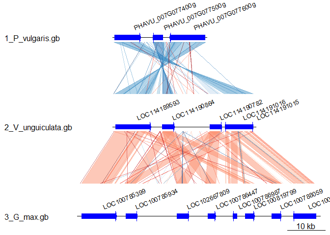
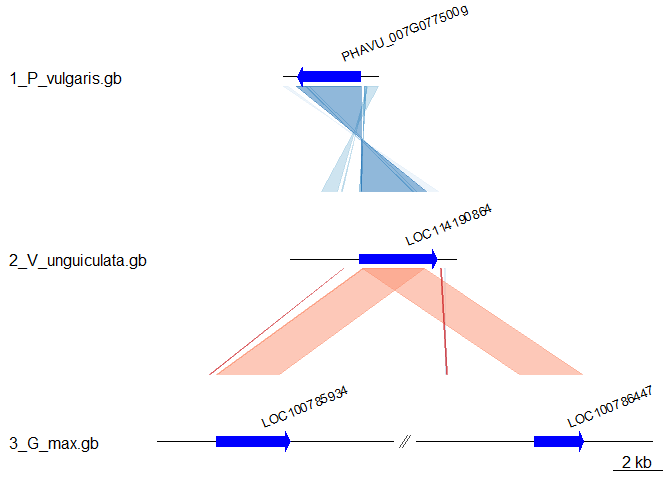

custom GenoplotR
================

-   [About the scripts](#about-the-scripts)
-   [Load libraries](#load-libraries)
-   [Specify feature and input directory](#specify-feature-and-input-directory)
-   [Read genbank files](#read-genbank-files)
-   [Plot gene map](#plot-gene-map)
-   [optional: xlims; specify which parts of subsequent plots are included](#optional-xlims-specify-which-parts-of-subsequent-plots-are-included)
-   [Output pdf](#output-pdf)

About the scripts
-----------------

Adam Steinbrenner <br> <astein10@uw.edu> <br> <http://steinbrennerlab.org> <br> Updated 5/10/2019 <br> <br> The following takes genbank files and output a sequential genoplot using features of interest. Input is .gb files and .txt files containing outfmt 6 blastn output. See <http://genoplotr.r-forge.r-project.org/> for details

------------------------------------------------------------------------

Load libraries
--------------

------------------------------------------------------------------------

Specify feature and input directory
-----------------------------------

Script below will look for this feature in each genbank and pull start/stop positions

``` r
feature<-"gene"
```

Input directory should have any number of .gb (genbank files to turn into DNA segs) and .txt files (the blast outputs from comparing these segs)

``` r
dir1<-"C:/Users/Adam/Dropbox/github/alluvial_diagrams/alluvial_diagrams/data/genoplot"
```

The python code below quickly generates all comparisons in a folder populated with .gb files, if blast is installed locally

    #Converts all .gb to .fa.
    #Extracts whole sequence using option -s whole
    for i in *.gb; do
        echo $i
        python genbank_to_fasta.py -i $i -m genbank -o ${i%%.*}.fa -s whole
    done

    #Makes blastn comparisons for each two .fa files in abc order, called 1.txt 2.txt 3.txt ...
    a=0
    for j in *.fa; do
        echo $a
        array+=($j)
        if [ $a = 0 ]
        then
            array=($j)
        else
            blastn -query ${array[a-1]} -subject ${array[a]} -gapopen 5 -gapextend 2 -reward 2 -penalty -3 -task blastn -evalue 1 -word_size 10 -outfmt 6 > $a.txt
        fi
        let "a += 1"
        echo $j
        #echo ${array[@]}
        echo ${array[a-1]}
        #   blastn -query j -subject seqB -gapopen 5 -gapextend 2 -reward 2 -penalty -3 -task blastn -outfmt 6 > seqA_seqB.txt
    done

------------------------------------------------------------------------

Read genbank files
------------------

The script reads all .gb files into a list using read\_dna\_seg, then all .txt using read\_comparison. Genoplot functions read these nicely

``` r
file.names <- dir(dir1, pattern ="\\.gb$")
print(file.names)
```

    ## [1] "1_P_vulgaris.gb"    "2_V_unguiculata.gb" "3_G_max.gb"

``` r
j <- 1
segs <- vector("list",0)
genbanks <- vector("list",0)
for(i in 1:length(file.names)){
  seg <- read_dna_seg_from_file(paste("C:/Users/Adam/Dropbox/github/alluvial_diagrams/alluvial_diagrams/data/genoplot/",file.names[i],sep=""),tagsToParse = c(feature),gene_type = "arrows",fill="blue")
  ##BUG: make sure all files have the feature listed!!
  name <- file.names[i]
  segs[[j]] <- seg
  genbanks[[j]] <- name
  j <- j+1
}

#adds name of each .gb file to the list of DNAsegs
names(segs) <- genbanks

#Pull the middle position and gene name
annot1 <- lapply(segs,function(x){
  mid <- middle(x)
  annot <- annotation(x1=mid,text=x$name,rot=22)
})
```

Then read comparisons from all .txt files in a folder

``` r
file.names <- dir("C:/Users/Adam/Dropbox/github/alluvial_diagrams/alluvial_diagrams/data/genoplot", pattern ="\\.txt$")
j <- 1
comps <- vector("list",0)
for(i in 1:length(file.names)){
  comps[[j]] <- read_comparison_from_blast(paste("C:/Users/Adam/Dropbox/github/alluvial_diagrams/alluvial_diagrams/data/genoplot/",file.names[i],sep=""))
  j <- j+1
}
```

------------------------------------------------------------------------

Plot gene map
-------------

``` r
plot_gene_map(dna_segs=segs, comparisons=comps, annotations=annot1,annotation_height=3)
```



optional: xlims; specify which parts of subsequent plots are included
---------------------------------------------------------------------

``` r
xlims <- list(c(10000,14000),
            c(11000,18000),c(10000,20000,30000,40000))
plot_gene_map(dna_segs=segs, comparisons=comps, annotations=annot1,annotation_height=3,xlims=xlims)
```



Output pdf
----------

``` r
file <- "C:/Users/Adam/Dropbox/github/alluvial_diagrams/alluvial_diagrams/data/genoplot/genoplot_output.pdf"
pdf(file)
#alternative, constraint the dimensions
#pdf(file,10,3)
plot_gene_map(dna_segs=segs, comparisons=comps, annotations=annot1,annotation_height=2)
dev.off()
```

    ## png 
    ##   2
