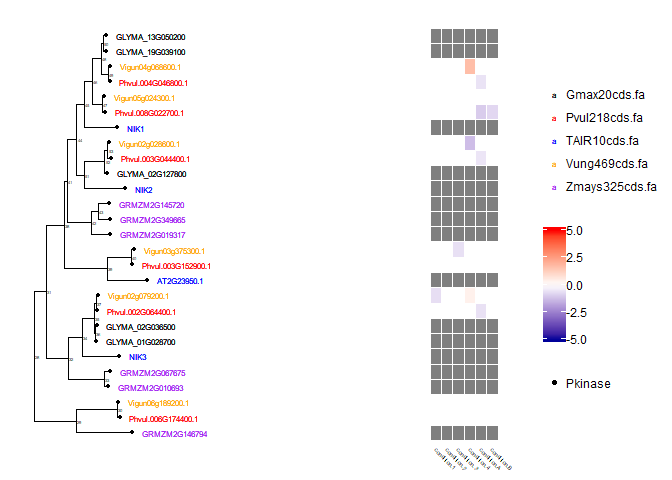

ggtree
================

-   [About the scripts](#about-the-scripts)
-   [Download ggtree.R and data](#download-ggtree.r-and-data)
-   [Install packages](#install-packages)
-   [Load libraries](#load-libraries)
-   [Usage and Options](#usage-and-options)
-   [Inputs: newick tree, attribute files, heatmap data](#inputs-newick-tree-attribute-files-heatmap-data)
-   [Subtrees](#subtrees)
-   [ggTree object](#ggtree-object)
-   [pdf output](#pdf-output)
-   [Fortify to write list of genes](#fortify-to-write-list-of-genes)
-   [Using the output csv, you can call a python script to get the original nucleotide sequences from the parsed, merged, fasta file! This output fa is in the same order as the tree](#using-the-output-csv-you-can-call-a-python-script-to-get-the-original-nucleotide-sequences-from-the-parsed-merged-fasta-file-this-output-fa-is-in-the-same-order-as-the-tree)

About the scripts
-----------------

Adam Steinbrenner <br> <astein10@uw.edu> <br> <http://steinbrennerlab.org> <br> Updated 5/10/2019 <br> <br> The following describes ggtree.R, a custom script for using ggtree for phylogenetics tree visualization incorporating other attributes and heatmaps

------------------------------------------------------------------------

Download ggtree.R and data
--------------------------

Find ggtree.R in main directory, and all input files in /data/ggtree

------------------------------------------------------------------------

Install packages
----------------

The function tree\_subset may require the development version of treeio; make sure it is current from github

    source("https://bioconductor.org/biocLite.R")
    biocLite("EBImage")
    biocLite("treeio")
    biocLite("ggtree")
    install.packages("phytools")
    install.packages("optparse")
    install.packages("tidyselect")
    install.packages("tidyselect")
    install.packages("labeling")
    install.packages("devtools")
    devtools::install_github("GuangchuangYu/treeio")

------------------------------------------------------------------------

Load libraries
--------------

``` r
library("ggplot2")
```

    ## Warning: package 'ggplot2' was built under R version 3.5.2

``` r
library("treeio")
library("phytools") # for sims and ASRs
```

    ## Warning: package 'phytools' was built under R version 3.5.2

    ## Loading required package: ape

    ## Warning: package 'ape' was built under R version 3.5.2

    ## 
    ## Attaching package: 'ape'

    ## The following object is masked from 'package:treeio':
    ## 
    ##     drop.tip

    ## Loading required package: maps

    ## 
    ## Attaching package: 'phytools'

    ## The following object is masked from 'package:treeio':
    ## 
    ##     read.newick

``` r
library("EBImage") # for images
```

    ## 
    ## Attaching package: 'EBImage'

    ## The following object is masked from 'package:ape':
    ## 
    ##     rotate

``` r
library("ggtree")
```

    ## Warning: package 'ggtree' was built under R version 3.5.2

    ## ggtree v1.14.6  For help: https://guangchuangyu.github.io/software/ggtree
    ## 
    ## If you use ggtree in published research, please cite the most appropriate paper(s):
    ## 
    ## - Guangchuang Yu, David Smith, Huachen Zhu, Yi Guan, Tommy Tsan-Yuk Lam. ggtree: an R package for visualization and annotation of phylogenetic trees with their covariates and other associated data. Methods in Ecology and Evolution 2017, 8(1):28-36, doi:10.1111/2041-210X.12628
    ## 
    ## - Guangchuang Yu, Tommy Tsan-Yuk Lam, Huachen Zhu, Yi Guan. Two methods for mapping and visualizing associated data on phylogeny using ggtree. Molecular Biology and Evolution 2018, accepted. doi: 10.1093/molbev/msy194

    ## 
    ## Attaching package: 'ggtree'

    ## The following objects are masked from 'package:EBImage':
    ## 
    ##     flip, rotate

    ## The following objects are masked from 'package:phytools':
    ## 
    ##     read.newick, reroot

    ## The following object is masked from 'package:ape':
    ## 
    ##     rotate

``` r
library("optparse")
```

    ## Warning: package 'optparse' was built under R version 3.5.3

sessionInfo()

------------------------------------------------------------------------

Usage and Options
-----------------

usage: take an output from blastaligntree: the query ENTRY, the DATABASE its from, and BLASTED: the set of parameters used for tblast n e.g. `Rscript tree.R -e Vigun07g219600.1 -o output_testing`

first two options specify the folder, blasted specifies the filename

    option_list <- list( 
      make_option(c("-e", "--entry"), action="store", type="character",
            help="entry"),
        make_option(c("-o", "--output"), action="store", type="character", 
            help="name for file writing"),
        make_option(c("-n", "--node"), action="store", default=0, type="integer", 
            help="number of total sequences!  used to compute font size")
        )
    opt <- parse_args(OptionParser(option_list=option_list))

------------------------------------------------------------------------

Inputs: newick tree, attribute files, heatmap data
--------------------------------------------------

Newick tree

``` r
tree <- read.tree("C:/Users/Adam/Dropbox/github/alluvial_diagrams/alluvial_diagrams/data/ggtree/tree_input.nwk")
```

Attribute files, tab delimited with columns taxa and atttribute

``` r
dd <- read.table("C:/Users/Adam/Dropbox/github/alluvial_diagrams/alluvial_diagrams/data/ggtree/attribute_species.txt", sep="\t", header = TRUE, stringsAsFactor=F)
```

#### heatmap

``` r
counts_file <- read.table("C:/Users/Adam/Dropbox/github/alluvial_diagrams/alluvial_diagrams/data/ggtree/log2FoldChanges.txt", sep="\t", row.names = 1, header = TRUE, stringsAsFactor=F)

#Set upper and lower limits, used to set colors!
upper <- 5
lower <- -5
```

------------------------------------------------------------------------

Subtrees
--------

OPTIONAL: can take a subset of the original tree; use a node 1 deeper than you want! For example, try the NIK3 clade using `node <- 34`

``` r
#node<-opt$node
node<-0
###
if (node>0) {
nodenum <- opt$node
message("Node input detected.  Subtree based on node:")
message(opt$node)
tree <- tree_subset(tree, nodenum, levels_back = 1) #Right now a bug with levels_back=0 is preventing me from specifying the node ITSELF
}
```

------------------------------------------------------------------------

ggTree object
-------------

``` r
q <- ggtree(tree, size=0.1) #size specifies line size
###OPTIONAL: adds hmm coding to ggtree object q
###OPTIONAL: takes hmm_coding and adds to a separate dataframe dd2
dd2 <- read.table("C:/Users/Adam/Dropbox/github/alluvial_diagrams/alluvial_diagrams/data/ggtree/attribute_hmm.txt", sep="\t", header = TRUE, stringsAsFactor=F)
q <- q %<+% dd2

node_count <- length(tree$tip.label)
print("The number of nodes is:")
```

    ## [1] "The number of nodes is:"

``` r
print(node_count)
```

    ## [1] 27

``` r
size <-  3.63 - (0.484*log(node_count)) #computes appropriate font size for tree based on good sizes for 10, 30, and 100
#size <- 2.5 #use a default font size instead
size2 <- (size/2)
print("The tip label font size is")
```

    ## [1] "The tip label font size is"

``` r
message(size)
```

    ## 2.0348149568539

``` r
print("The node label font size is")
```

    ## [1] "The node label font size is"

``` r
message(size2)
```

    ## 1.01740747842695

``` r
q <- q %<+% dd + geom_tiplab(size=size,offset=0.05,aes(color=species)) + geom_tippoint(aes(size=size2,shape=hmm)) + scale_size_identity() #you need scale_size_identity! https://groups.google.com/forum/#!topic/bioc-ggtree/XHaq9Sk3b00

figure <- gheatmap(q,counts_file, offset = 1.5, width=0.6, font.size=1.5, colnames_angle=-45, hjust=0) + 
    geom_tiplab(size=size,offset=0.05,aes(color=species)) +
    scale_fill_gradient2(low="#000099",high="#FF0000",mid="white",limits=c(lower,upper)) +
    #node labels
    geom_text2(aes(subset=!isTip, label=node), hjust=-.3, size=size2) + 
    scale_colour_manual(values=c("black","red","blue","orange","purple","darkgreen","cadetblue","deeppink","darkgoldenrod","brown4","olivedrab2"))
```

    ## Scale for 'fill' is already present. Adding another scale for 'fill',
    ## which will replace the existing scale.

``` r
figure
```



------------------------------------------------------------------------

pdf output
----------

``` r
file <- "C:/Users/Adam/Dropbox/github/alluvial_diagrams/alluvial_diagrams/data/ggtree/output_testing.pdf"
message(file)

pdf(file)
figure
dev.off()
```

------------------------------------------------------------------------

Fortify to write list of genes
------------------------------

``` r
#Takes the tree object and converts it to a tidy dataframe using fortify, then reorders it according to the graphical position!
#Apparently fortify might deprecate and switch to the "broom" package for tidying data
tips <- fortify(tree)
tips <- data.frame(tips$label,tips$y,tips$isTip)
tips <- tips[order(tips[,3],tips[,2],decreasing=T),]
#Writes the tips to a csv file.  Name is based on the option -b specified when the script is called
file_csv <- "C:/Users/Adam/Dropbox/github/alluvial_diagrams/alluvial_diagrams/data/ggtree/output_testing.csv"
message(file_csv)

for(i in 1:node_count) {
write(as.matrix(tips)[,1][i],file=file_csv,sep=",",append=T)
}
```

Using the output csv, you can call a python script to get the original nucleotide sequences from the parsed, merged, fasta file! This output fa is in the same order as the tree
================================================================================================================================================================================

    system(paste("python extract_seq.py ",opt$entry," ",opt$output,".csv",sep=""))

Old code is included in the R markdown file below but hidden in the html rendering. It might contain some useful snippets
